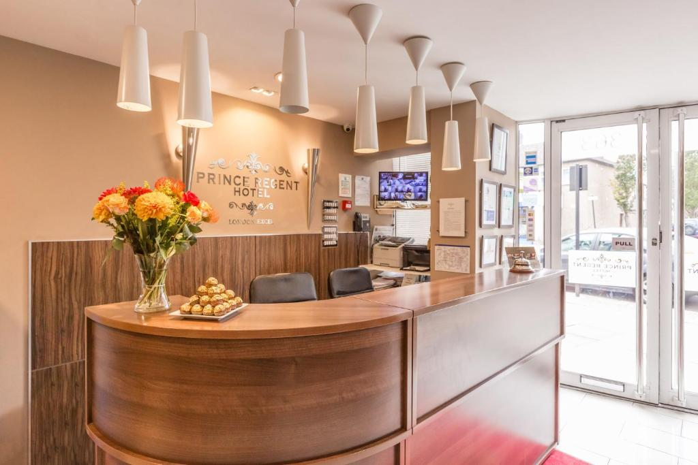
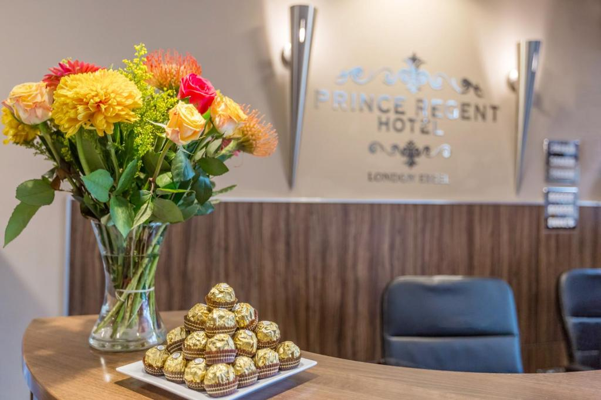
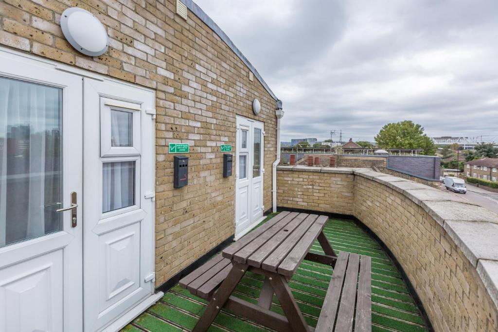

# Nuestra Estancia en el Prince Regent Hotel Excel London

¡Vamos a quedarnos en el **Prince Regent Hotel Excel London** durante nuestra estancia en Londres! Aquí vamos a poder descansar de estos largos y maravillosos días jiji

## Características del Hotel

- **Ubicación:** A solo unos minutos del centro de Londres y cerca de las estaciones de metro. Perfecto para visitar los principales lugares turísticos.
- **Comodidades:** Habitaciones modernas, conexión Wi-Fi gratuita.
- **Ambiente:** Un ambiente acogedor y amigable, ideal para relajarnos y recargar energías.

## Fotos del Hotel

Aquí tienes algunas fotos del hotel, ya verás que chulo:

## Enlace para verlo

Aquí te dejo el enlace para poder ver el hotel [Prince Regent Hotel Excel London - Booking](https://www.booking.com/hotel/gb/prince-regent-excel-london.es.html)

---

¡Con esto y un bizcocho en londres a las 8 🌟
