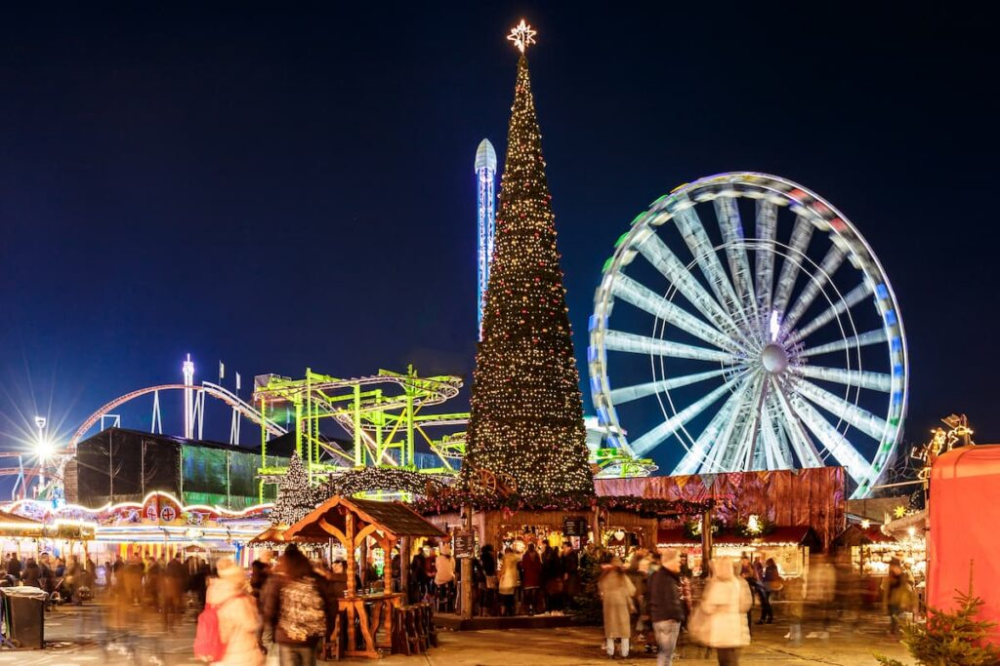
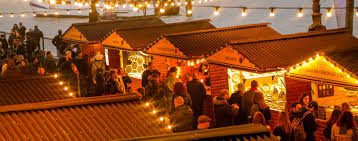
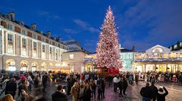
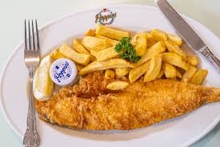

# ¿Qué haremos en Londres?

Te prometo que será un viaje lleno de momentos mágicos, desde caminar bajo las luces navideñas hasta descubrir rincones fascinantes de esta increíble ciudad.

## Nuestro itinerario

| Día               | Actividades                                                                                           |
|-------------------|------------------------------------------------------------------------------------------------------|
| 21 de Noviembre   | Llegada al Prince Regent Hotel Excel London y visita a los mercados navideños 🎄                       |
| 22 de Noviembre   | Freetour por la mañana y entrada a Winter Wonderland 🎡                                                |
| 23 de Noviembre   | Visitando la ciudad y día libre                                                                       |

## Mercados Navideños Imperdibles

### 1. Winter Wonderland en Hyde Park  
📍 Cómo llegar: Desde Acton Town, toma la línea Piccadilly hasta **Hyde Park Corner** y camina 10-15 minutos.  
🎟️ *Entrada*: [Incluida, dale click y verás que chulo es](https://hydeparkwinterwonderland.com/)  
🎡 **Qué vamos a hacer**: Patinaje sobre hielo, atracciones emocionantes, comida deliciosa y querernos mucho jiji  

### 2. Southbank Centre Winter Market  
📍 Cómo llegar: Piccadilly hasta Leicester Square, cambio a la Northern Line hasta **Waterloo**. A 10 minutos a pie.  
🛍️ **Qué hacer**: Disfruta de la variedad de comida, artesanías y espectáculos, todo junto al icónico río Támesis.  

### 3. Covent Garden Christmas Market  
📍 Cómo llegar: Piccadilly Line hasta **Covent Garden**.  
🎄 **Qué hacer**: Maravíllate con las decoraciones navideñas, disfruta de los espectáculos en vivo y pasea entre encantadores puestos de mercado.  

## Lugares Imperdibles

- **Big Ben** y **Parliament Square** para una foto clásica junto a las cabinas telefónicas.  
- **Museo Británico** lleno de historia.  
- **New Bond Street** donde vamos a ver las luces navideñas más chulas y impresionantes.  

---

## Recomendaciones Culinarias

Londres es un paraíso para los amantes de la comida, ¡y tenemos algunos lugares imperdibles!
- **Regency Café** 🍳: Un auténtico desayuno inglés.  

- **Poppies Fish & Chips** 🐟🍟: No puede faltar en nuestra lista.  

- **Asador en Camden Market**: ¡Carne jugosa y deliciosa!  

- **BunSik** y **BunHouse** en ChinaTown para probar las mejores delicias asiáticas.  

---

## Dulces Tentaciones

- **Dragon Cat Cafe** 🍰: El famoso pastel caliente de Oreo es un must.  

- **Humble Crumble** 🥧: Sitio de crumbles, ¡te encantará!  

---

## TikToks recomendados para nuestro viaje

Aquí te dejo algunos TikToks que vamos a usar para inspirarnos y disfrutar de lo mejor en Londres:

1. [New Bond Street](https://www.tiktok.com/@gemelosviajeros/video/7306574863156645153?lang=es&q=cosas%20que%20hay%20que%20hacer%20en%20londres%20navidad&t=1726398050327)
2. [Palacio de Buckingham (Cambio de guardia)](https://www.tiktok.com/@gemelosviajeros/video/7303976579460238624?lang=es&q=cosas%20que%20hay%20que%20hacer%20en%20londres%20navidad&t=1726398050327)
3. [Ruta de 1 día para ver Londres](https://www.tiktok.com/@kelseyinlondon/video/7309166695145295137?lang=es&q=cosas%20que%20hay%20que%20hacer%20en%20londres%20navidad&t=1726398050327)
4. [Variedad de comidas en Londres](https://vm.tiktok.com/ZGeE2tWmv/)
5. [Asador en Camden Market](https://www.tiktok.com/@annappleadayy/video/7271578399892688160?lang=es&q=sitios%20donde%20comer%20en%20londres&t=1726397318070)
6. [SudItalia Pizza](https://www.tiktok.com/@viajerasxelmundoo/video/7396748495111179552?lang=es&q=sitios%20donde%20comer%20en%20londres&t=1726397318070)
7. [Dragon Cat Cafe - Pastel Caliente Oreo](https://www.tiktok.com/@cristinacarryon/video/7210807571286887686?lang=es&q=sitios%20donde%20comer%20en%20londres&t=1726397318070)
8. [Humble Crumble](https://www.tiktok.com/@viajerasxelmundoo/video/7334016626615995681?lang=es&q=sitios%20donde%20comer%20en%20londres&t=1726397318070)

---

## Estoy super orgulloso de nosotros, de verdad te quiero mucho ❤️‍🩹

> "Va a ser la mejor navidad juntitos" 💑
